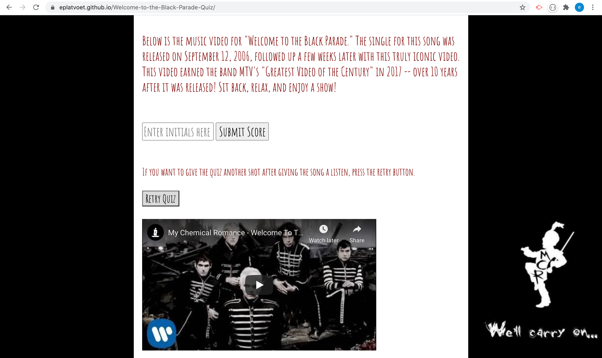

# Welcome-to-the-Black-Parade-Quiz  
# 

## TABLE OF CONTENTS
- [DESCRIPTION](#DESCRIPTION)  
- [LICENSE](#LICENSE)  
- [INSTALLATION](#INSTALLATION)  
- [TECHNOLOGIES](#TECHNOLOGIES)  
- [QUESTIONS](#QUESTIONS)  
- [CONTRIBUTIONS](#CONTRIBUTIONS)
- [LINKS](#LINKS)  
- [SCREENSHOTS](#SCREENSHOTS) 

## DESCRIPTION
Welcome to the "Welcome to the Black Parade" by My Chemical Romance. Test your knowledge of the intro to this iconic song by answering a quick series of questions. Don't worry, I included the music video at the end for anybody who feels the urge to sing along after completing the quiz!  

## LICENSE
Unlicensed

## INSTALLATION
N/A

## TECHNOLOGIES  
- HTML  
- CSS  
- JavaScript  
 
## QUESTIONS
My GitHub username is *eplatvoet* & my profile can be found [here](https://github.com/eplatvoet) 

## CONTRIBUTIONS
Feel free to fork the repository if any upgrades/features can be implemented. I can be reached at erin.didomenico520@gmail.com if you have any other questions about this repository.

## LINKS
[REPO](https://github.com/eplatvoet/Welcome-to-the-Black-Parade-Quiz)
[DEPLOYED](https://eplatvoet.github.io/Welcome-to-the-Black-Parade-Quiz/)  

## SCREENSHOT
  
